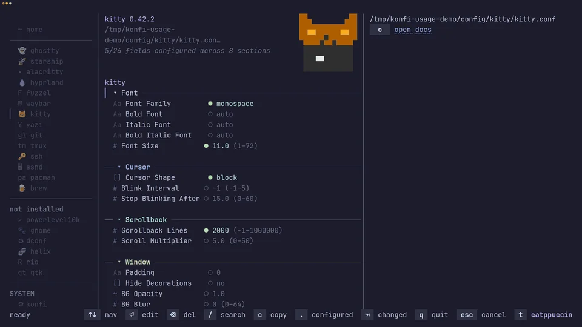

# konfi

Eye-candy TUI for our everyday tools configs.
Built on the shoulders of [bubbletea](https://github.com/charmbracelet/bubbletea) and [lipgloss](https://github.com/charmbracelet/lipgloss).



## Features

- Atomic file saves to avoid half-written configs.
- Configuration validation before save on supported tools.
- Configurable backups before writes.
- Full-text search across fields, descriptions, and values.
- Quick docs jump for supported apps and fields.
- Rich field editors: file select, colors, enums, numeric steppers, and multi-column lists.
- Grouped configuration editing for block-style configs like `ssh` and `sshd`.
- Diff preview before saving.
- Undo and per-field revert for local edits.

## Install

### Install Script

```bash
curl -fsSL https://raw.githubusercontent.com/getkonfi/konfi/main/install.sh | sh
```

Install-script and source installs can update in place with (`--check` to preview):

```bash
konfi update
```

### Homebrew

```bash
brew tap getkonfi/tap
brew install konfi
```

### Nix

```bash
nix shell github:getkonfi/nur-packages#konfi
```

Release package files, including `.deb`, `.rpm`, and archive builds, are
available on the [latest release](https://github.com/getkonfi/konfi/releases/latest).

### From Source

```bash
git clone https://github.com/getkonfi/konfi.git
cd konfi
make build
sudo install -m 0755 konfi /usr/local/bin/konfi
```

Run without installing:

```bash
make run
```

## Supported Konfables

| App | Version support | Fields |
| --- | --- | ---: |
| [`alacritty`](https://github.com/alacritty/alacritty) | `0.13.0-0.17.0` | [74](src/konfables/alacritty/schema.yaml) |
| [`brew`](https://github.com/Homebrew/homebrew-bundle) | `<= 6.0.2` | [5](src/konfables/brew/schema.yaml) |
| [`dconf`](https://gitlab.gnome.org/GNOME/dconf) | `<= 50.1` | [16](src/konfables/dconf/schema.yaml) |
| [`fuzzel`](https://codeberg.org/dnkl/fuzzel) | `<= 1.14.1` | [13](src/konfables/fuzzel/schema.yaml) |
| [`ghostty`](https://github.com/ghostty-org/ghostty) | `1.0.0-1.3.1` | [200](src/konfables/ghostty/schema.yaml) |
| [`git`](https://github.com/git/git) | `<= 2.54.0` | [37](src/konfables/git/schema.yaml) |
| [`gnome`](https://gitlab.gnome.org/GNOME/gsettings-desktop-schemas) | `<= 50.1` | [36](src/konfables/gnome/schema.yaml) |
| [`gtk`](https://gitlab.gnome.org/GNOME/gtk) | `<= 4.22.4` | [9](src/konfables/gtk/schema.yaml) |
| [`helix`](https://github.com/helix-editor/helix) | `24.7.0-25.1.0` | [26](src/konfables/helix/schema.yaml) |
| [`hypridle`](https://github.com/hyprwm/hypridle) | `<= 0.1.7` | [11](src/konfables/hypridle/schema.yaml) |
| [`hyprland`](https://github.com/hyprwm/Hyprland) | `0.40.0-0.55.4` | [103](src/konfables/hyprland/schema.yaml) |
| [`kitty`](https://github.com/kovidgoyal/kitty) | `0.35.0-0.47.4` | [26](src/konfables/kitty/schema.yaml) |
| [`konfi`](https://github.com/getkonfi/konfi) | `<= 0.32.7` | [5](src/konfables/konfi/schema.yaml) |
| [`pacman`](https://gitlab.archlinux.org/pacman/pacman) | `<= 7.1.0` | [23](src/konfables/pacman/schema.yaml) |
| [`powerlevel10k`](https://github.com/romkatv/powerlevel10k) | `<= 1.20.0` | [78](src/konfables/powerlevel10k/schema.yaml) |
| [`rio`](https://github.com/raphamorim/rio) | `0.1.0-0.4.7` | [25](src/konfables/rio/schema.yaml) |
| [`ssh`](https://github.com/openssh/openssh-portable) | `<= 10.3p1` | [36](src/konfables/ssh/schema.yaml) |
| [`sshd`](https://github.com/openssh/openssh-portable) | `<= 10.3p1` | [44](src/konfables/sshd/schema.yaml) |
| [`starship`](https://github.com/starship/starship) | `<= 1.25.1` | [99](src/konfables/starship/schema.yaml) |
| [`tmux`](https://github.com/tmux/tmux) | `<= 3.6b` | [38](src/konfables/tmux/schema.yaml) |
| [`waybar`](https://github.com/Alexays/Waybar) | `<= 0.15.0` | [11](src/konfables/waybar/schema.yaml) |
| [`yazi`](https://github.com/sxyazi/yazi) | `<= 26.5.6` | [7](src/konfables/yazi/schema.yaml) |

## Development

```bash
make tools
make test
make lint
```

Local release build:

```bash
make release-snapshot
```
